# Jarkom-Modul-1-2026-K-56

| No  | Nama                           | NRP        |
| --- | ------------------------------ | ---------- |
| 1   | Sahira Bilqis Rivadito         | 5027251037 |
| 2   | Muhammmad Ridwan               | 5027251113 |

HAI BOS BEKASI

## Laporan
### No 1
---
"Lain yang berperan sebagai Router membuat tiga Switch/Gateway:
-  Switch 1 menuju dua Entitas yaitu Alice dan Mika
- Switch 2 menuju Chisa
- Switch 3 menuju Knights dan Eiri"

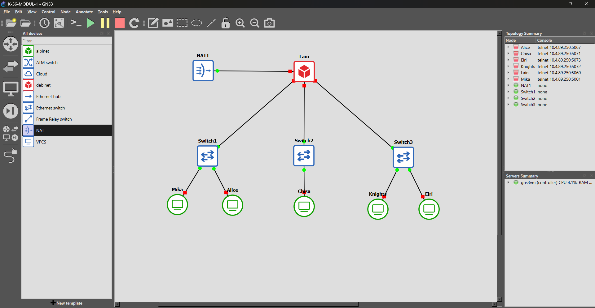

Pada soal ini dibuatnya topologi jaringan sesuai dengan yang diminta di soal, seperti beberapa konfigurasi berikut:
- NAT : untuk mendapatkan dynamic ip dhcp  dan bisa terkoneksi ke internet
- Router Lain : sebagai networking yang tersambung dengan NAT, menggunakan debinet
- Switch 1, 2, dan 3 : sebagai gateway antar client yang terkoneksi ke router
- Client (Alice, Mika, Chisa, Knights, dan Eiri) : client yang terhubung dalam topologi jaringan.

### No 2
---
"Konfigurasi router Lain agar tersambung ke jaringan internet publik melalui NAT/DHCP pada interface eth0"

Agar Lain (router) terkoneksi, kita harus melakukan configure terhadap interface Lain yang terhubung ke NAT. Masukkan konfigurasi ke Network configurationnya :

```
auto eth0
iface eth0 inet dhcp
```
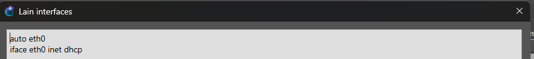

Bertujuan untuk melakukan setup interface eth0 yang terhubung ke NAT

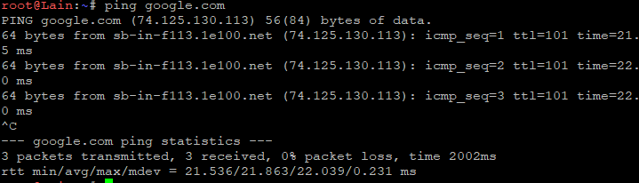

### No 3
---
"Setelah router Lain terhubung ke internet, pastikan seluruh Entitas (Client) di bawah Switch 1, Switch 2, dan Switch 3 dapat saling terhubung dan berkomunikasi satu sama lain melalui konfigurasi routing."

Karena Lain berperan sebagai router pusat dan tiap switch berada di subnet berbeda (192.239.1.0/24, 192.239.2.0/24, 192.239.3.0/24), supaya antar-entitas bisa saling ping, dua hal dibutuhkan: 
-  aktifkan IP forwarding di router Lain supaya paket diteruskan antar interface eth1/eth2/eth3
-   set IP static + default gateway di tiap client mengarah ke interface Lain pada switch masing-masing.

```
# LAIN — aktifkan ip forwarding supaya Switch1/2/3 bisa saling routing
sysctl -w net.ipv4.ip_forward=1
echo "net.ipv4.ip_forward = 1" >> /etc/sysctl.conf
sysctl -p

# ALICE
auto eth0
iface eth0 inet static
    address 192.239.1.2
    netmask 255.255.255.0
    gateway 192.239.1.1

# MIKA
auto eth0
iface eth0 inet static
    address 192.239.1.3
    netmask 255.255.255.0
    gateway 192.239.1.1

# CHISA
auto eth0
iface eth0 inet static
    address 192.239.2.2
    netmask 255.255.255.0
    gateway 192.239.2.1

# KNIGHTS
auto eth0
iface eth0 inet static
    address 192.239.3.2
    netmask 255.255.255.0
    gateway 192.239.3.1

# EIRI
auto eth0
iface eth0 inet static
    address 192.239.3.3
    netmask 255.255.255.0
    gateway 192.239.3.1
```

1[image](assets/soal3_1.png)

# S0AL 4
---
"Konfigurasikan firewall/iptables (NAT Masquerade) dan DNS resolver agar setiap Client dapat terhubung ke internet secara mandiri (ping ke 8.8.8.8 dan membuka domain google.com)."

Gateway saja belum cukup, karena IP private client (192.239.x.x) tidak dikenali di internet publik. NAT Masquerade di Lain menerjemahkan source IP client menjadi IP publik eth0 Lain saat paket keluar. Selain itu tiap client butuh DNS resolver supaya bisa translate nama domain jadi IP.

```
# LAIN
apk update && apk add iptables
iptables -t nat -A POSTROUTING -o eth0 -j MASQUERADE
iptables -A FORWARD -i eth1 -o eth0 -j ACCEPT
iptables -A FORWARD -i eth2 -o eth0 -j ACCEPT
iptables -A FORWARD -i eth3 -o eth0 -j ACCEPT
iptables -A FORWARD -i eth0 -m state --state ESTABLISHED,RELATED -j ACCEPT

# jalankan di SETIAP client: Alice, Mika, Chisa, Knights, Eiri
echo "nameserver 8.8.8.8" > /etc/resolv.conf

ping -c3 8.8.8.8
ping google.com
```

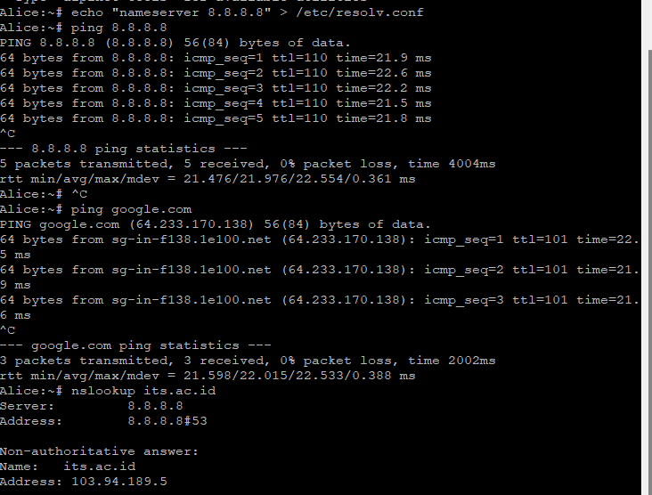

# S0AL 5
---
"Buat script verifikasi di /root/cek_status.sh pada router Lain yang menampilkan ringkasan interface (ip -br a) dan status tabel NAT (iptables -t nat -L -v -n) setelah reboot."

Script ini dipakai untuk memastikan konfigurasi interface dan NAT rule tidak hilang setelah router di-restart — cukup jalankan satu file untuk cek dua hal sekaligus.

```
#!/bin/sh
ip -br a
iptables -t nat -L -v -n
chmod +x /root/cek_status.sh

# jalankan setelah reboot untuk membuktikan konfigurasi tidak hilang
/root/cek_status.sh
```

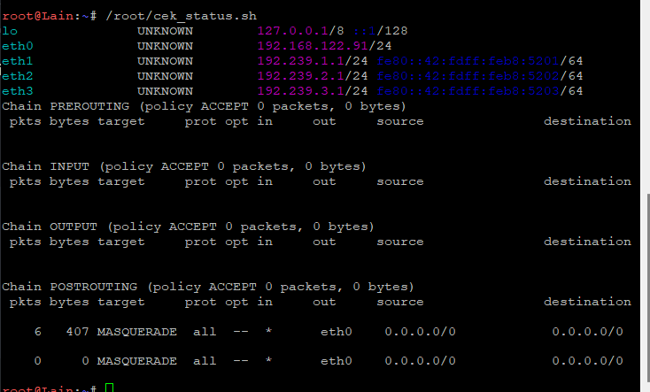

# S0AL 6
---
"Jalankan generator traffic pada node Mika, lalu lakukan packet sniffing menggunakan Wireshark dengan display filter khusus DNS atau ICMP."

Script ini membangkitkan trafik ICMP (ping) dan DNS (nslookup) supaya ada paket yang bisa ditangkap dan disaring lewat filter dns or icmp di Wireshark.

```
# MIKA
# supaya nslookup/dig tersedia di Alpine
apk add bind-tools

#!/bin/sh
echo "[*] Generating DNS & ICMP traffic..."
ping -c 5 8.8.8.8
nslookup google.com 8.8.8.8
echo "[*] Done."

chmod +x /root/traffic_protocol7.sh
```

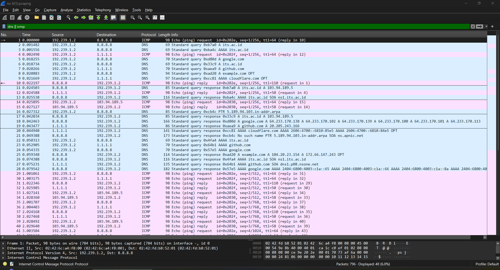

### No 7
---

"Chisa mendirikan FTP Server dengan shared folder di /var/wired/data. Kebijakan akses: alice (read & write), mika (read-only), eiri (blacklist)."

Menggunakan vsftpd, ketiga user berbagi direktori yang sama (/var/wired/data) tapi diberi hak berbeda lewat user_config_dir: alice diberi write_enable=YES, mika write_enable=NO. Eiri sengaja tidak dimasukkan ke user_list (whitelist), sehingga login-nya otomatis ditolak server (userlist_deny=NO berarti hanya user yang ada di list yang diizinkan login).

```
# Update repository dan install FTP Server
apk update
apk add vsftpd

# Membuat user FTP
adduser alice
adduser mika
adduser eiri

# Membuat shared folder
mkdir -p /var/wired/data

# Alice sebagai pemilik folder
chown alice:alice /var/wired/data
chmod 755 /var/wired/data

# Membuat direktori konfigurasi per-user
mkdir -p /etc/vsftpd/user_conf

# Alice = Read & Write
local_root=/var/wired/data
write_enable=YES

# Mika = Read Only
local_root=/var/wired/data
write_enable=NO

# Konfigurasi utama VSFTPD
listen=YES
anonymous_enable=NO
local_enable=YES
write_enable=YES

local_root=/var/wired/data

chroot_local_user=YES
allow_writeable_chroot=YES

pasv_enable=YES
pasv_min_port=30000
pasv_max_port=30100
pasv_promiscuous=YES

userlist_enable=YES
userlist_deny=NO
userlist_file=/etc/vsftpd/user_list

user_config_dir=/etc/vsftpd/user_conf
local_umask=022

seccomp_sandbox=NO

# Menjalankan FTP Server
killall vsftpd 2>/dev/null
vsftpd /etc/vsftpd/vsftpd.conf &

# Cek FTP Server pada port 21
busybox netstat -lnt | grep ':21'

apk add lftp
lftp 192.239.2.2

put signal_alice.txt
ls
get signal_alice.txt
```

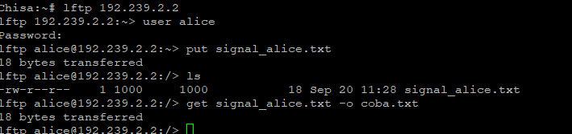

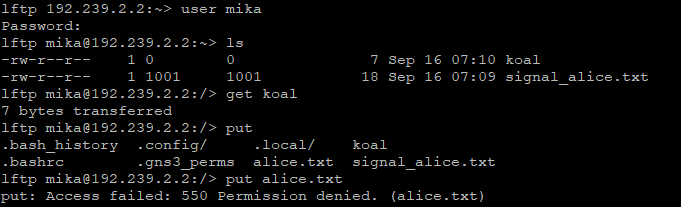

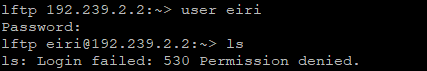

### No 8
---

"Knights mengirimkan dokumen laporan intelijen ke FTP Server Chisa menggunakan akun alice. Analisis perintah STOR, kode status 226, dan port data TCP mode PASV."

```
# KNIGHTS
cd 8
lftp 192.239.2.2
user alice
set ftp:passive-mode true
put knights_report.zip
ls
```


Di Wireshark filter ftp || ftp-data, cari perintah STOR laporan_intelijen.txt, response 226 Transfer complete, dan port data hasil negosiasi PASV (di paket response 227 Entering Passive Mode).


### No 9
---

"Mika mengunduh dokumen Protokol Tujuh dari FTP Server Chisa menggunakan akun mika, lalu buktikan pembatasan read-only (error 550) saat mencoba upload."

```
# MIKA
apk add lftp
lftp 192.239.2.2\

user mika
ls
get protocol7_manifesto.zip
put file_baru.txt
```
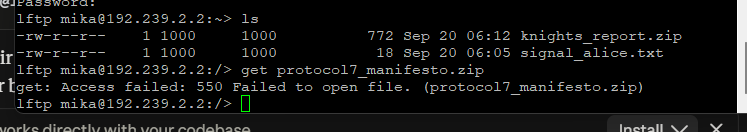

### No 10
---

"Knights menguji latensi jaringan dengan mengirim 77 paket ping payload 128 byte, interval 0.3 detik, ke node Chisa. Analisis ICMP Type/Code Echo Request vs Reply, packet loss, dan RTT."

```
# KNIGHTS
ping -c 77 -s 128 -i 0.3 192.239.2.2
```

Di Wireshark filter icmp, catat Type 8 (Echo Request) dari Knights dan Type 0 (Echo Reply) dari Chisa; ambil statistik packet loss & RTT min/avg/max dari output ping di terminal.

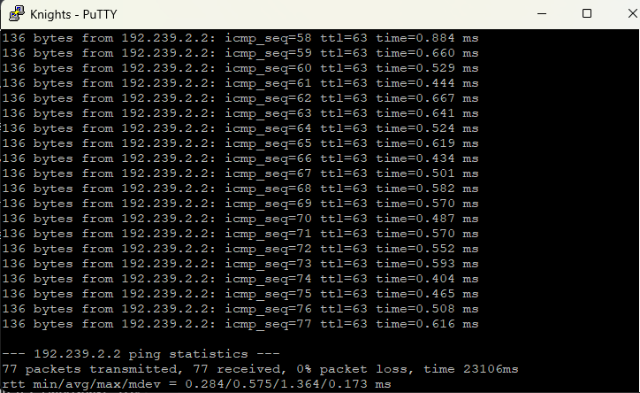

### No 11
---

"Buktikan kelemahan protokol Telnet dengan akun phantom_user/wired_ghost pada node Chisa. Login Telnet dari Eiri, capture di Wireshark, dan tunjukkan kredensial plain text via Follow TCP Stream."

```
# CHISA
apk add busybox-extras
adduser phantom_user
# masukkan password: wired_ghost
telnetd -p 23 &

# EIRI
apk add busybox-extras
telnet 192.239.2.2
# login: phantom_user / wired_ghost
```
Capture di link Eiri↔Switch3, filter telnet, klik kanan salah satu paket → Follow → TCP Stream. Kredensial terlihat plain text, dan tiap karakter terkirim dalam paket TCP terpisah karena Telnet mengirim per-keystroke tanpa buffering/enkripsi.

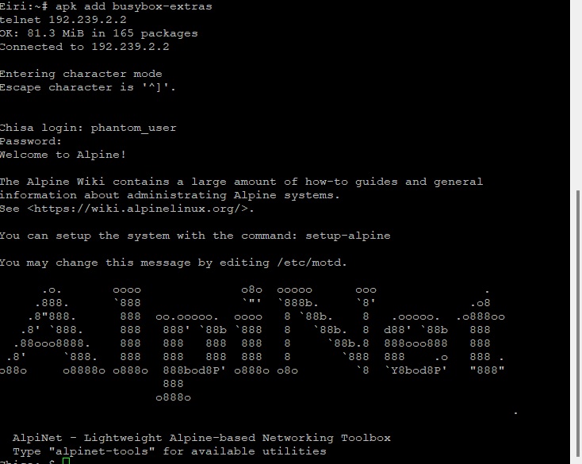

### No 12
---

"Alice memindai port pada node Knights menggunakan Netcat untuk cek port 22 & 80 (terbuka) serta port rahasia 7777 (tertutup). Analisis perbedaan TCP flag SYN-ACK vs RST-ACK."

```
# KNIGHTS — siapkan layanan agar port 22 & 80 terbuka, 7777 tertutup
rc-service sshd start
apk add python3
python3 -m http.server 80 &

# ALICE
nc -zv 192.239.3.2 22 80 7777
```

Di Wireshark: port terbuka (22, 80) → handshake normal SYN → SYN-ACK → ACK. Port tertutup (7777) → SYN → RST-ACK (langsung ditolak karena tidak ada service listening).

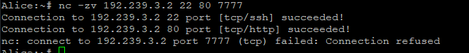

### No 13
---
"Lain memerintahkan administrasi jarak jauh via SSH tanpa password. Setup key-based authentication antara Mika (mika_admin) dan Knights, lalu jelaskan perbedaan dengan Telnet."

```
# KNIGHTS (server tujuan)
apk add openssh
ssh-keygen -A
adduser -D mika_admin
mkdir -p /home/mika_admin/.ssh
sed -i 's/^#*PasswordAuthentication.*/PasswordAuthentication no/' /etc/ssh/sshd_config
/usr/sbin/sshd

# MIKA (client, tetap sebagai root, JANGAN su ke mika_admin)
apk add openssh-client
ssh-keygen -t ed25519
# Enter semua (biarkan default, tanpa passphrase)
cat ~/.ssh/id_ed25519.pub

# KNIGHTS — paste public key Mika di sini
echo "<paste_public_key_mika_disini>" >> /home/mika_admin/.ssh/authorized_keys
chown -R mika_admin:mika_admin /home/mika_admin/.ssh
chmod 700 /home/mika_admin/.ssh
chmod 600 /home/mika_admin/.ssh/authorized_keys

# MIKA — connect (masih sebagai root, tapi login sebagai mika_admin di remote)
ssh mika_admin@192.239.3.2

# Wireshark
# tcp.port == 22
```


```
# Knights
sed -i 's/^PasswordAuthentication no/PasswordAuthentication yes/' /etc/ssh/sshd_config
pkill sshd
/usr/sbin/sshd

# Mika
cat ~/.ssh/id_ed25519.pub | ssh mika_admin@192.239.3.2 "mkdir -p ~/.ssh && chmod 700 ~/.ssh && cat >> ~/.ssh/authorized_keys && chmod 600 ~/.ssh/authorized_keys"

# Knights
sed -i 's/^PasswordAuthentication yes/PasswordAuthentication no/' /etc/ssh/sshd_config
pkill sshd
/usr/sbin/sshd

#Mika
ssh mika_admin@192.239.3.2
```

Filter tcp.port == 22, identifikasi paket Protocol Version Exchange (baris pertama pertukaran versi SSH client/server) dan Key Exchange Init (SSH_MSG_KEXINIT). Setelah key exchange selesai, seluruh sesi termasuk autentikasi terenkripsi — berbeda dengan Telnet yang mengirim semuanya plain text.

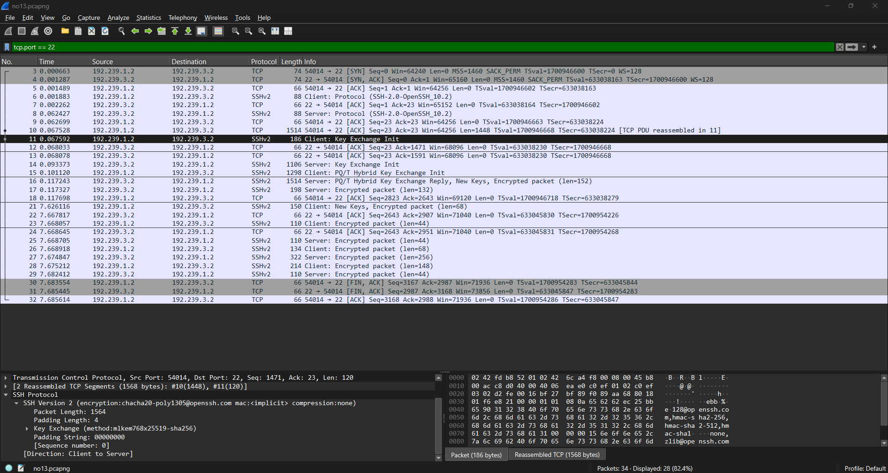

### S0AL 14 | PROtocol 7
---
  Pada soal ini dilakukan analisis terhadap file capture `wired_bruteforce.pcapng` menggunakan Wireshark untuk mengidentifikasi aktivitas brute-force terhadap form login web.

Informasi yang dicari meliputi:

- IP address attacker
- IP address + port target
- Username yang berhasil ditembus
- Password yang digunakan
- Web server software beserta versinya

Hasil analisis kemudian divalidasi menggunakan socket server melalui `nc [IP_GROUP C] 3401`.

Berikut LAngkahnya : 
1. Open `wired_bruteforce.pcapng` menggunakan Wireshark
2. Input `http.request.method == "POST"` in Display filter dan karena serangannya berupa brute-force terhadap form login web
3. kita fokus mencari user lain_admin, maka put `http contains "lain_admin"` di Display filter
4. Open **Hypertext Transfer Protocol**, dan cari apa yang di perlukan. Pada soal di perlukan seperti list yang di atas untuk deperlukan dalam Netcat
5. Open terminal, put `nc [IP_GROUP C] 3401` dan gunakan ip_group_c yang telah di sediakan di mastersheet (karna kita group c).
6. Jawab semua pertanyaan dengan semua informasi yang telah kamu dapatkan

7. nanti gambar + `flag : Congratulations! Here is your flag: KOMJAR26{W1r3d_Brut3_1bBmXXuaxjlV9hNvBrTk60Bcl} `

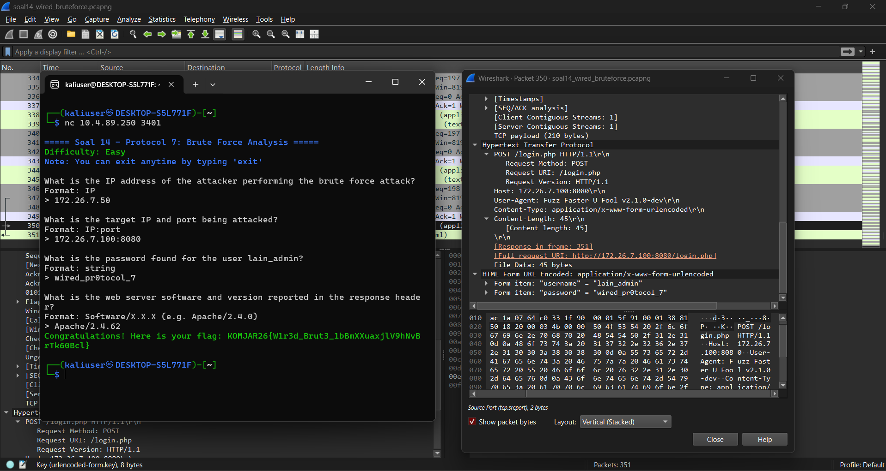
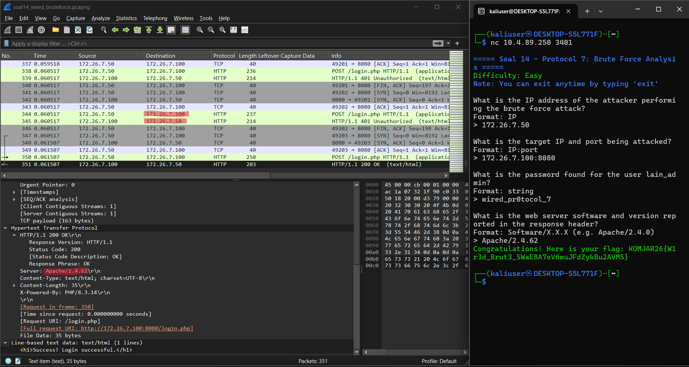

### S0AL 15 | USB HID
---

Pada soal ini dilakukan analisis terhadap file capture `wired_usb_hid.pcap` menggunakan Wireshark untuk mengidentifikasi perangkat USB keyboard berbahaya yang digunakan untuk mencuri keystroke.

Informasi yang dicari meliputi:

- Vendor ID perangkat USB
- Product ID perangkat USB
- Device Address perangkat USB
- Pesan rahasia yang berhasil dicuri dari keystroke

Hasil analisis kemudian divalidasi menggunakan socket server melalui `nc [IP_GROUP C] 3402`.

Berikut LAngkahnya :
1. Open `wired_usb_hid.pcap` menggunakan Wireshark.
2. Input `usb.device_address` pada **Display Filter** untuk mencari komunikasi perangkat USB.
3. Cari packet **GET DESCRIPTOR Response DEVICE**, kemudian buka bagian **DEVICE DESCRIPTOR**.
4. Pada bagian **DEVICE DESCRIPTOR**, cari informasi:
   - **idVendor** → Vendor ID
   - **idProduct** → Product ID
5. Untuk mencari alamat perangkat USB, gunakan Display Filter: `usb.device_address != 0`
6. Dari hasil filter tersebut, ditemukan **Device Address = 7**. Alamat ini digunakan untuk memfokuskan analisis terhadap komunikasi perangkat USB tersebut.
7. Untuk melihat data keystroke, fokus pada packet **URB_INTERRUPT in** dari perangkat dengan Device Address 7. Kemudian buka bagian **USB URB** dan cari **Leftover Capture Data**. 
9. Untuk merekonstruksi left over capture data kami menggunakan GitHub nya beliau, cloning. https://github.com/RajChowdhury240/usb-keystrokes-ctf-tool
10. Setelah mendapatkan seluruh informasi yang diperlukan, buka terminal dan jalankan:

    `nc [IP_GROUP C] 3402`

    Gunakan `IP_GROUP_C` yang telah disediakan di mastersheet karena kelompok yang digunakan adalah **Group C**.

11. Jawab seluruh pertanyaan dari socket server menggunakan informasi yang telah diperoleh dari hasil analisis Wireshark.

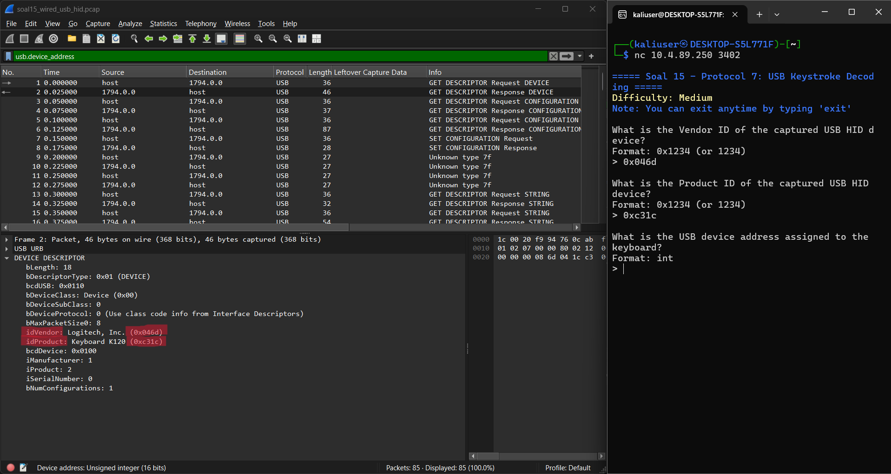
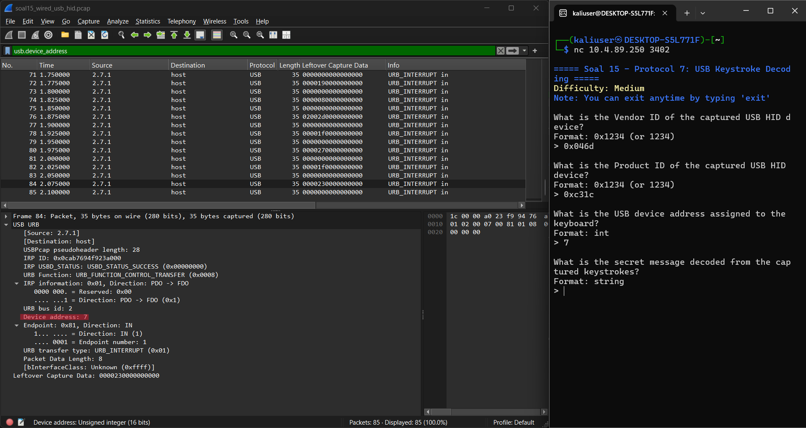
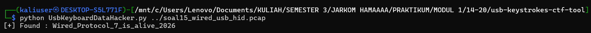
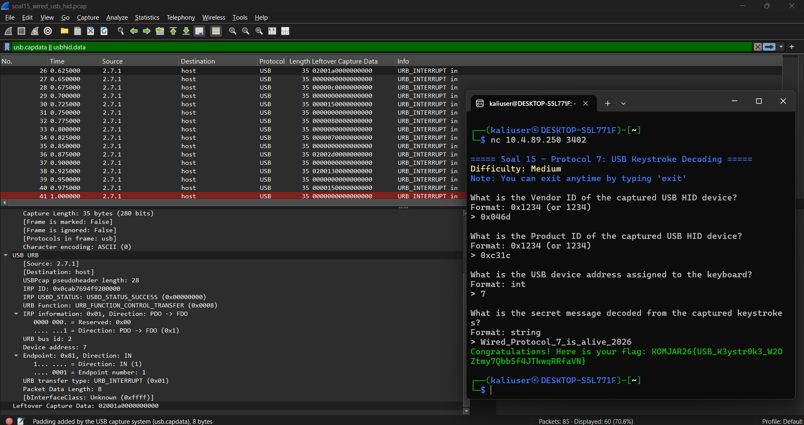

    `flag : Congratulations! Here is your flag: KOMJAR26{...}`


### S0AL 16 | FTP Theft
---

Pada soal ini dilakukan analisis terhadap file capture `wired_ftp_theft.pcapng` menggunakan Wireshark untuk mengidentifikasi aktivitas FTP yang dilakukan oleh attacker dan file malware yang diunduh.

Informasi yang dicari meliputi:

- IP address server FTP penyerang
- Banner software FTP yang digunakan
- Kredensial login attacker
- Nama file malware yang diunduh
- Ukuran file malware dalam bytes

Hasil analisis kemudian divalidasi menggunakan socket server melalui `nc [IP_GROUP] 3403`.

Berikut LAngkahnya :
1. Open `wired_ftp_theft.pcapng` menggunakan Wireshark.
2. Karena soal meminta analisis lalu lintas FTP, input `ftp` pada **Display Filter**.
3. Pada packet yang muncul, cari response dengan kode `220` karena response tersebut merupakan banner yang dikirimkan oleh FTP server ketika terjadi koneksi. Untuk memfilter response tersebut, gunakan: `ftp.response.code == 220`
5. Dari hasil analisis ditemukan **banner** : `220 Welcome to Wired FTP Server (vsftpd 3.0.5)` Sehingga software FTP yang digunakan adalah **vsftpd 3.0.5**.
6. Dari packet tersebut juga dapat diketahui bahwa **IP server FTP** penyerang adalah: `198.51.100.7`
7. Selanjutnya cari **kredensial login attacker** dengan menggunakan Display Filter: `ftp.request.command == "USER" || ftp.request.command == "PASS"`
8. Dari hasil analisis ditemukan login attacker :
   `USER knights_agent`
   `PASS N4v1_s3cur3_2026`
   Sehingga kredensial yang digunakan adalah : `knights_agent:N4v1_s3cur3_2026`
9. Selanjutnya cari **file malware** yang diunduh menggunakan Display Filter : `ftp.request.command == "RETR"`
10. Cari packet yang memiliki request : `RETR knights_payload.exe`
11. Setelah menemukan packet tersebut, lihat response dari server. Pada capture terdapat: `Response: 213 524288` dan `Response: 150 Opening BINARY mode data connection for knights_payload.exe (524288 bytes).`. Dari response tersebut dapat diketahui bahwa ukuran file `knights_payload.exe` adalah: `524288 bytes`
13. Setelah mendapatkan seluruh informasi yang diperlukan, buka terminal dan jalankan: `nc [IP_GROUP] 3403`.  Gunakan `IP_GROUP` yang telah disediakan di mastersheet karena kelompok yang digunakan adalah **Group C**.
14. Jawab seluruh pertanyaan dari socket server menggunakan informasi yang telah diperoleh dari hasil analisis Wireshark.
15. Setelah semua jawaban benar, akan muncul flag:

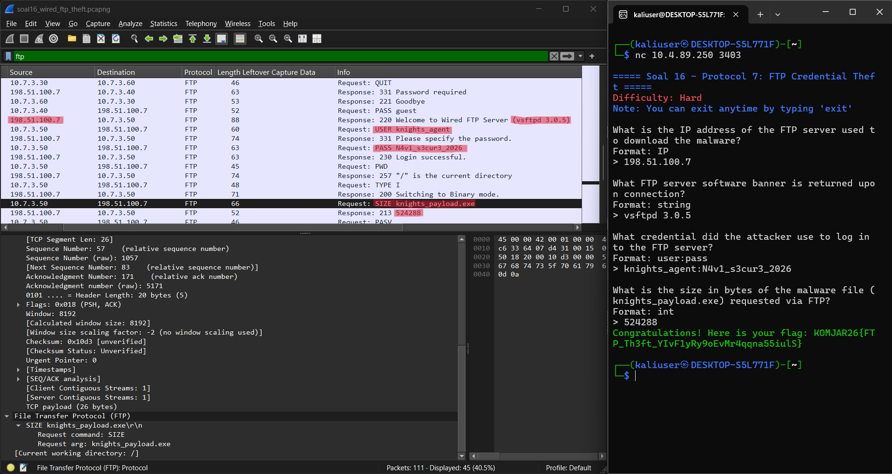

    `flag : Congratulations! Here is your flag: KOMJAR26{...}`


### S0AL 17 | HTTP C2
---

Pada soal ini dilakukan analisis terhadap file capture `wired_http_c2.pcap` menggunakan Wireshark untuk mengidentifikasi aktivitas HTTP yang dilakukan oleh attacker dalam mengunduh payload berbahaya ke sistem Alice.
Informasi yang dicari meliputi:

- Nama domain (Host) tempat malware diunduh
- IP address server penyerang
- Nama file executable malware yang diunduh
- Kode status HTTP yang dikembalikan

Hasil analisis kemudian divalidasi menggunakan socket server melalui `nc [IP_GROUP] 3404`.

Berikut LAngkahnya :
1. Open `wired_http_c2.pcap` menggunakan Wireshark.
2. Karena soal meminta analisis lalu lintas HTTP, input `http` pada **Display Filter**.
3. Untuk mencari file executable malware yang diunduh, gunakan Display Filter : `http.request.uri contains ".exe"`. Dari hasil filter, ditemukan packet dengan request : `GET /navi_agent.exe HTTP/1.1`
5. Buka bagian **Hypertext Transfer Protocol** pada packet tersebut. Dari bagian tersebut dapat ditemukan : `Host: wired-update.net`
6. Sehingga nama domain tempat malware diunduh adalah : `wired-update.net`
7. Dari packet tersebut juga dapat diketahui alamat IP server penyerang. Pada bagian **Internet Protocol Version 4** terlihat : `Src: 10.7.1.50` dan `Dst: 203.0.113.42`
8. Karena request dikirim dari Alice menuju server, maka IP server penyerang adalah : `203.0.113.42`
9. Dari request HTTP juga ditemukan nama file executable yang diunduh : `navi_agent.exe`
10. Selanjutnya periksa packet response setelah request `GET /navi_agent.exe HTTP/1.1`. Pada packet tersebut terdapat : `HTTP/1.1 200 OK`. Sehingga kode status HTTP yang dikembalikan adalah : `200 OK`
11. Setelah mendapatkan seluruh informasi yang diperlukan, buka terminal dan jalankan : `nc [IP_GROUP] 3404`
   Gunakan `IP_GROUP` yang telah disediakan di mastersheet karena kelompok yang digunakan adalah **Group C**.
10. Jawab seluruh pertanyaan dari socket server menggunakan informasi yang telah diperoleh dari hasil analisis Wireshark.
11. Setelah semua jawaban benar, akan muncul flag:

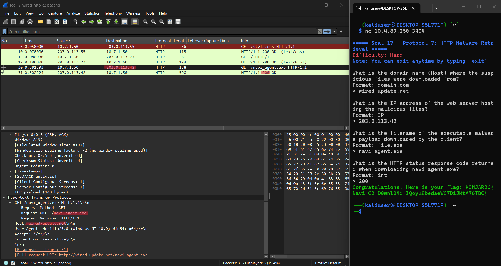

    gambar + `flag : Congratulations! Here is your flag: KOMJAR26{...}`


### S0AL 18 | SMB Transfer
---

Pada soal ini dilakukan analisis terhadap file capture `wired_smb_transfer.pcapng` menggunakan Wireshark untuk mengidentifikasi aktivitas transfer file malware melalui protokol SMB.
Informasi yang dicari meliputi:

- Nama protokol jaringan yang dieksploitasi
- IP address pengirim
- IP address penerima
- Folder tujuan penyimpanan malware pada sistem korban
- Nama file executable malware yang ditransfer

Hasil analisis kemudian divalidasi menggunakan socket server melalui `nc [IP_GROUP] 3405`.
Berikut LAngkahnya :
1. Open `wired_smb_transfer.pcapng` menggunakan Wireshark.
2. Karena soal meminta analisis lalu lintas SMB, input `smb2` pada **Display Filter**. Dari hasil filter, terlihat komunikasi menggunakan protokol **SMB2**.
4. Untuk melihat proses transfer file, perhatikan packet yang memiliki informasi seperti:
   `Create Request`
   `Write Request`
   `Close Request`
5. Pada packet **Create Request** ditemukan : `Create Request, File: System32\wired_trojan_payload.exe`. Dari informasi tersebut dapat diketahui folder tujuan penyimpanan malware adalah: `System32`
6. Pada packet tersebut juga dapat dilihat alamat IP : `Src: 10.7.3.100` dan `Dst: 10.7.1.50`
   Namun, untuk menentukan pengirim dan penerima file, perhatikan alur transfer pada packet **Write Request**. File ditransfer dari sistem attacker menuju sistem korban.
7. Dari alur komunikasi SMB pada capture, diperoleh:

   - IP Pengirim: `10.7.1.50`
   - IP Penerima: `10.7.3.100`

8. Nama file executable malware yang ditransfer adalah : `wired_trojan_payload.exe`
9. Pada proses **Tree Connect** juga terlihat akses ke administrative share : `\\10.7.1.50\ADMIN$`. Kemudian file ditulis pada lokasi : `System32\wired_trojan_payload.exe`
10. Setelah mendapatkan seluruh informasi yang diperlukan, buka terminal dan jalankan : `nc [IP_GROUP] 3405`
    Gunakan `IP_GROUP` yang telah disediakan di mastersheet karena kelompok yang digunakan adalah **Group C**.
11. Jawab seluruh pertanyaan dari socket server menggunakan informasi yang telah diperoleh dari hasil analisis Wireshark.
12. Setelah semua jawaban benar, akan muncul flag:

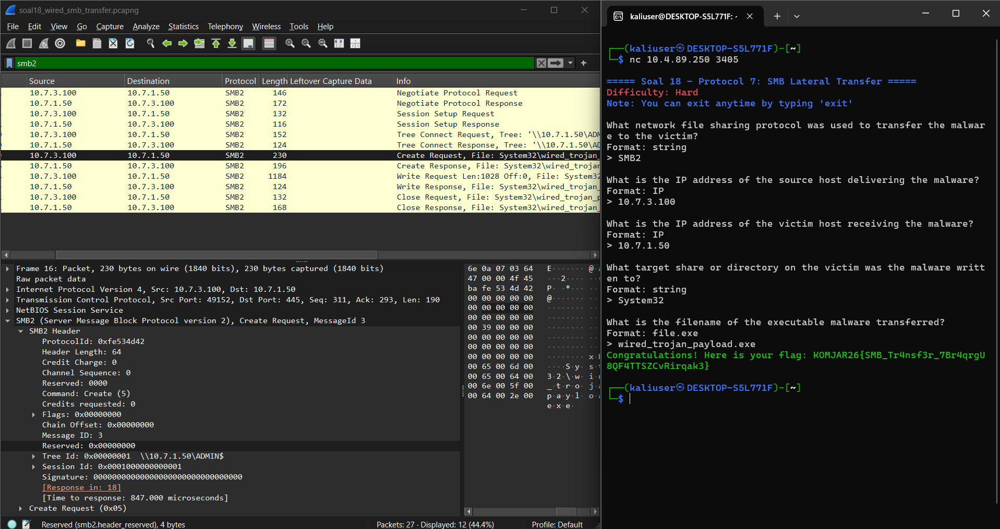

    gambar + `flag : Congratulations! Here is your flag: KOMJAR26{...}`

# S0AL 19 | SMTP Threat
Pada soal ini dilakukan analisis terhadap file capture `wired_smtp_threat.pcap` menggunakan Wireshark untuk mengidentifikasi email pemerasan yang dikirim oleh attacker melalui protokol SMTP tanpa enkripsi.
Informasi yang dicari meliputi:

- Alamat email korban yang ditargetkan
- Password korban yang diklaim bocor oleh penyerang
- Jenis malware yang menginfeksi korban
- Batas waktu yang diberikan oleh penyerang dalam satuan hari
- MailClientID yang tercantum pada pesan

Hasil analisis kemudian divalidasi menggunakan socket server melalui `nc [IP_GROUP] 3406`.
Berikut LAngkahnya :
1. Open `wired_smtp_threat.pcap` menggunakan Wireshark.
2. Karena soal meminta analisis lalu lintas SMTP, input `smtp` pada **Display Filter**.
3. Dari hasil filter, cari packet yang berisi komunikasi SMTP, terutama packet dengan informasi seperti:
   `MAIL FROM`
   `RCPT TO`
   `DATA`
4. Karena email dikirim menggunakan SMTP tanpa enkripsi, isi pesan dapat dianalisis melalui TCP Stream.
5. Klik salah satu packet SMTP yang berkaitan dengan email tersebut, kemudian klik kanan pada packet dan pilih:
   **Follow → TCP Stream**
6. Pada TCP Stream, cari bagian isi email setelah perintah : `DATA`. Bagian tersebut berisi pesan pemerasan yang dikirim oleh attacker kepada korban. Dari isi pesan tersebut, identifikasi alamat email korban yang ditargetkan.
8. Selanjutnya cari informasi password korban yang diklaim bocor oleh penyerang di dalam isi pesan dan Cari juga informasi mengenai jenis malware yang disebutkan telah menginfeksi sistem korban.
10. Identifikasi batas waktu yang diberikan oleh penyerang kepada korban. Catat nilainya dalam satuan hari.
11. Pada isi email juga terdapat `MailClientID`. Catat nilai `MailClientID` tersebut sesuai dengan yang tercantum pada pesan.
12. Setelah mendapatkan seluruh informasi yang diperlukan, buka terminal dan jalankan : `nc [IP_GROUP] 3406`
    Gunakan `IP_GROUP` yang telah disediakan di mastersheet karena kelompok yang digunakan adalah **Group C**.
13. Jawab seluruh pertanyaan dari socket server menggunakan informasi yang telah diperoleh dari analisis TCP Stream pada Wireshark.
14. Setelah semua jawaban benar, akan muncul flag:

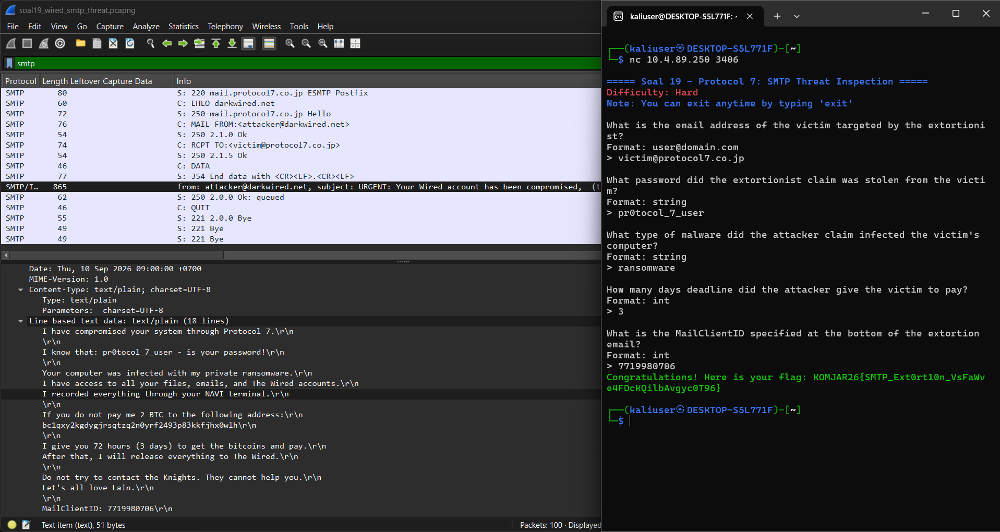

    gambar + `flag : Congratulations! Here is your flag: KOMJAR26{...}`

# S0AL 20 | TLS Decrypt
Pada soal ini dilakukan analisis terhadap file capture `wired_tls_decrypt.pcapng` menggunakan Wireshark dengan bantuan `keyslogfile.txt` untuk mendekripsi lalu lintas TLS dan mengidentifikasi komunikasi HTTP yang tersembunyi di dalam sesi terenkripsi.
Informasi yang dicari meliputi:

- Versi protokol TLS yang dinegosiasikan
- Nama domain (SNI) yang diakses
- IP address server HTTPS penyerang
- User-Agent yang digunakan oleh client
- HTTP request method
- HTTP request path

Hasil analisis kemudian divalidasi menggunakan socket server melalui `nc [IP_GROUP] 3407`.
Berikut LAngkahnya :
0. Jangan lupa input keylogsfile.txt nya dulu nanti yeu (liat gpt langkahnya - pesan untuk gw)
1. Open `wired_tls_decrypt.pcapng` menggunakan Wireshark.
2. Karena soal meminta analisis lalu lintas TLS, input `tls` pada **Display Filter**.
3. Dari packet **Client Hello**, dapat dilihat informasi **Server Name (SNI)** yang diakses oleh client.
4. Pada packet **Client Hello** ditemukan : `Client Hello (SNI=example.com)`. Sehingga nama domain yang diakses adalah : `example.com`
5. Dari bagian **Internet Protocol Version 4** pada packet TLS dapat diketahui alamat IP server HTTPS.
   Source:
   `10.9.0.2`
   Destination:
   `93.184.216.34`
   Sehingga IP server HTTPS adalah:
   `93.184.216.34`
6. Dari hasil analisis packet TLS juga diketahui versi protokol yang digunakan : `TLSv1.2`. Karena isi HTTP berada di dalam koneksi TLS, diperlukan file keylog untuk melakukan dekripsi.

---
     ini gataw mw di pake atau ngga!
9. Buka : **Edit → Preferences → Protocols → TLS**
10. Pada bagian:

   **(Pre)-Master-Secret log filename**

   klik **Browse...**, kemudian pilih:

   `keyslogfile.txt`

   11. Klik **OK**, kemudian reload atau buka kembali file:

    `wired_tls_decrypt.pcapng`

---

12. Setelah keylog berhasil digunakan, masukkan `http` pada **Display Filter** untuk menampilkan lalu lintas HTTP yang telah berhasil didekripsi.
13. Pilih packet **HTTP Request**, kemudian buka bagian **Hypertext Transfer Protocol**.
14. Dari bagian tersebut dapat ditemukan **User-Agent** yang digunakan oleh client.
15. Pada bagian HTTP Request juga dapat diketahui:
    - HTTP Request Method
    - HTTP Request URI / Path
16. Catat seluruh informasi yang diperlukan sesuai dengan pertanyaan pada socket server.
17. Setelah mendapatkan seluruh informasi, buka terminal dan jalankan : `nc [IP_GROUP] 3407`
    Gunakan `IP_GROUP` yang telah disediakan di mastersheet karena kelompok yang digunakan adalah **Group C**.
18. Jawab seluruh pertanyaan dari socket server menggunakan informasi yang telah diperoleh dari hasil analisis Wireshark.
19. Setelah semua jawaban benar, akan muncul flag:

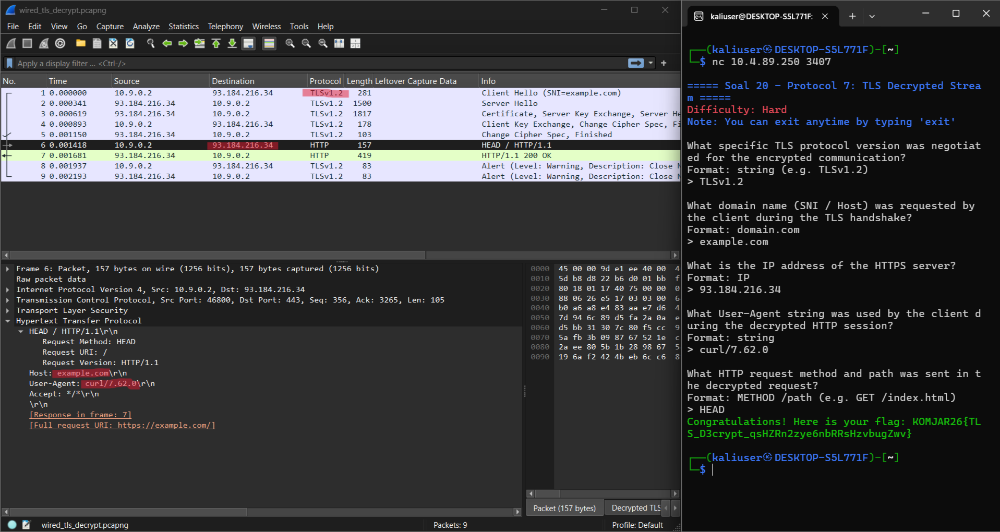

    gambar + `flag : Congratulations! Here is your flag: KOMJAR26{...}`
